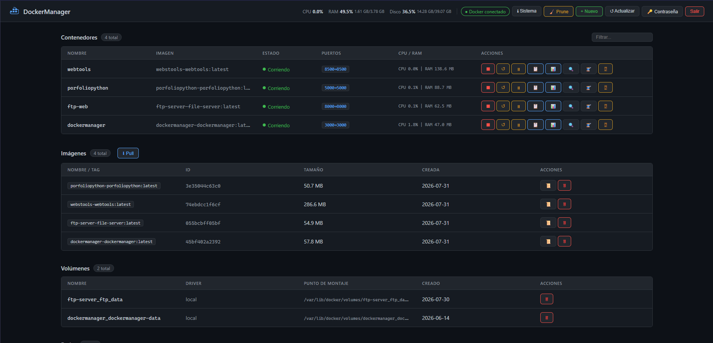

# DockerManager
---
> 🇬🇧 English | [🇪🇸 Español](docs/README.es.md)

A lightweight web interface for managing Docker from the browser. Built with FastAPI and vanilla JavaScript — no frontend frameworks, no external runtime dependencies.

  



## ✨ Features ✨
---

### Containers
- List all containers with name, image, status, ports, and live CPU/RAM stats
- Start, stop, restart, pause, and resume containers
- Create containers via UI: image, name, command, restart policy, ports, environment variables, volumes, and network
- Real-time log streaming with autoscroll, clear, and download as `.log`
- Interactive terminal (xterm.js) with automatic `bash`/`sh` detection and dynamic resize
- Live stats modal: CPU%, RAM%, network I/O, and a 60-point rolling chart (Chart.js)
- Inspect modal: network interfaces, mounts, environment, restart policy, resource limits
- Process list (`docker top`) with refresh
- Browser notifications when a container transitions out of `running`

### Images
- List images with tag, ID, size, and creation date
- Pull images by tag
- Delete images
- View layer history

### Volumes & Networks
- List, inspect, and delete volumes and networks
- Connect and disconnect containers from networks via the inspect modal

### System
- Host stats bar (CPU%, RAM, disk) updated every 4 seconds via `psutil`
- Docker daemon info: version, OS, kernel, architecture, storage driver
- One-click prune: stopped containers, dangling images, unused volumes, orphaned networks

### Security
- Session cookie: `HttpOnly`, `SameSite=Strict`
- Password hashing: bcrypt (cost 12)
- Brute-force protection: 5 failed attempts → 15-minute IP lockout
- XSS mitigation: all dynamic content escaped; CSP headers
- Anti-clickjacking: `X-Frame-Options: DENY`
- MIME sniffing prevention: `X-Content-Type-Options: nosniff`
- Timing-safe credential comparison via `secrets.compare_digest()`

### PWA
Installable as a desktop or mobile app via Chrome, Edge, or Safari.

## 🖥️ Requirements
---

- **Docker Engine** with the Compose plugin (`docker compose`) — the recommended path
- Access to the Docker socket (`/var/run/docker.sock`)
- A POSIX shell (`sh`), plus `awk` and `openssl` (or `/dev/urandom`) for `docker-up.sh`
- A free TCP port on the host (default `3000`)

Only if you install natively instead of with Docker (`install.sh`, Ubuntu + systemd):

- Python 3.12 with `python3-venv`
- The current user in the `docker` group

**Stack**

| Layer | Technology |
|---|---|
| Backend | Python 3.12, FastAPI, Uvicorn |
| Docker SDK | `docker` 7.1 |
| Host stats | `psutil` 6.1 |
| Auth | `bcrypt` (cost 12) |
| Real-time | WebSocket (logs, stats, terminal) |
| Terminal | xterm.js 5.3 + FitAddon |
| Charts | Chart.js 4.4 |
| Frontend | HTML + CSS + Vanilla JS |
| Deploy | Docker Compose |

## 📦 Installation guide ⚙️
---

### With Docker (recommended)

```bash
git clone https://github.com/FranciscoFdez05/DockerManager.git
cd DockerManager
./docker-up.sh
```

`docker-up.sh` creates the `.env` with a freshly generated `SECRET_KEY`, reads the listening port from `[server] port` in `config.ini`, and brings the stack up published on all interfaces. It prints the LAN URL when it finishes.

### Native install (Ubuntu + systemd)

```bash
bash install.sh
```

Installs the app in `/opt/dockergestor` with its own virtualenv and registers the `dockergestor` systemd service.

### Configuration

Everything is set in `config.ini`. Environment variables (`DATA_DIR`, `PORT`, `HOST`, `DOCKER_HOST`) take priority over the file.

| Section | Key | Default | Description |
|---|---|---|---|
| `server` | `port` | `3000` | Listening port |
| `server` | `bind_host` | `0.0.0.0` | Bind address |
| `docker` | `data_dir` | `./data` | Where `config.json` (user + password hash) is stored |
| `docker` | `docker_socket` | `/var/run/docker.sock` | Docker Unix socket |
| `security` | `session_max_age_days` | `30` | Session lifetime |
| `security` | `bcrypt_cost` | `12` | bcrypt hashing cost |
| `security` | `max_login_attempts` | `5` | Failed logins before lockout |
| `security` | `lockout_minutes` | `15` | Lockout duration |

### Updating

```bash
bash update.sh
```

Or manually:

```bash
docker compose down
./docker-up.sh
```

## 📋 Usage guide 🕹️
---

Open `http://<host-ip>:<port>` from any device on the same network (default port `3000`, change it in `config.ini` and re-run the script). On first launch, you will be prompted to create an admin account. Credentials are stored persistently in a Docker volume (`dockermanager-data`).

From there:

- **Containers** — the main table. Buttons per row for start/stop/restart/pause; click a container to open logs, terminal, stats, or inspect.
- **Images / Volumes / Networks** — tabs to list, pull, inspect, and delete.
- **System** — host and daemon info, plus the prune button.

If another machine on the LAN cannot connect, open the port in the server's firewall.

### Project structure

```
DockerManager/
├── main.py              # FastAPI app: REST API, WebSockets, auth
├── config.py            # config.ini + env var loader
├── config.ini           # Editable configuration
├── requirements.txt
├── Dockerfile
├── docker-compose.yml
├── docker-up.sh         # Startup script (.env + port + compose up)
├── install.sh           # Native installer (Ubuntu + systemd)
├── update.sh
├── docs/
│   └── README.es.md     # Spanish documentation
└── static/
    ├── index.html
    ├── style.css
    ├── app.js
    ├── favicon.svg
    └── manifest.json
```

### API reference

#### Auth

| Method | Route | Description |
|---|---|---|
| `GET` | `/api/auth/status` | Auth status (`setup_needed`, `authenticated`) |
| `POST` | `/api/auth/setup` | Initial account creation |
| `POST` | `/api/auth/login` | Login (rate-limited: 5 attempts / 15 min) |
| `POST` | `/api/auth/logout` | Logout |
| `POST` | `/api/auth/change-password` | Change password |

#### Containers

| Method | Route | Description |
|---|---|---|
| `GET` | `/api/containers` | List all |
| `POST` | `/api/containers/create` | Create |
| `POST` | `/api/containers/{id}/start` | Start |
| `POST` | `/api/containers/{id}/stop` | Stop |
| `POST` | `/api/containers/{id}/restart` | Restart |
| `POST` | `/api/containers/{id}/pause` | Pause |
| `POST` | `/api/containers/{id}/unpause` | Unpause |
| `DELETE` | `/api/containers/{id}` | Remove |
| `GET` | `/api/containers/{id}/inspect` | Full inspect |
| `GET` | `/api/containers/{id}/processes` | Process list (top) |
| `GET` | `/api/containers/{id}/stats_once` | Snapshot stats |
| `GET` | `/api/containers/{id}/logs/download` | Download logs |
| `POST` | `/api/containers/{id}/networks/connect` | Connect to network |
| `POST` | `/api/containers/{id}/networks/disconnect` | Disconnect from network |

#### Images

| Method | Route | Description |
|---|---|---|
| `GET` | `/api/images` | List |
| `DELETE` | `/api/images/{id}` | Remove |
| `POST` | `/api/images/pull` | Pull by tag |
| `GET` | `/api/images/{id}/history` | Layer history |

#### Volumes, Networks & System

| Method | Route | Description |
|---|---|---|
| `GET` | `/api/volumes` | List volumes |
| `DELETE` | `/api/volumes/{name}` | Remove volume |
| `GET` | `/api/networks` | List networks |
| `DELETE` | `/api/networks/{id}` | Remove network |
| `GET` | `/api/system/info` | Docker + host info |
| `GET` | `/api/system/host` | CPU / RAM / disk |
| `POST` | `/api/system/prune` | System prune |

#### WebSockets

| Route | Description |
|---|---|
| `WS /ws/containers/{id}/logs` | Real-time log stream |
| `WS /ws/containers/{id}/stats` | CPU / RAM / network stats (~1 s interval) |
| `WS /ws/containers/{id}/exec` | Interactive shell |

## 🤝 Contributions 🤝
---

Contributions are welcome. To propose a change:

1. Fork the repository and create a branch (`git checkout -b feature/my-feature`).
2. Make your changes, keeping the existing style (vanilla JS, no new runtime dependencies).
3. Test with `./docker-up.sh` before opening the PR.
4. Commit (`git commit -m "Add my feature"`), push, and open a Pull Request describing the change.

For bugs or ideas, open an [issue](https://github.com/FranciscoFdez05/DockerManager/issues).

## 📜 License
---
📄 This project is licensed under the MIT License. See the `LICENSE` file for details.

---

**Developed with ❤️ by [Francisco](https://github.com/FranciscoFdez05)**
